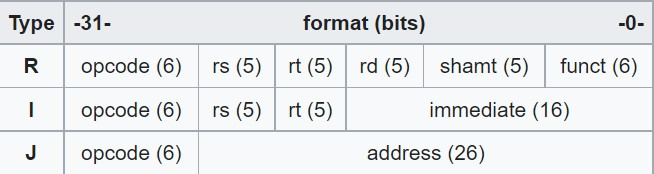
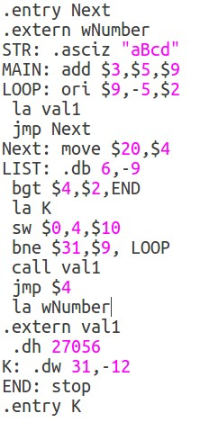
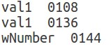
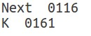

# This prject is final project in C course in OpenU of Israel. 2021b.
### The project is executing Assembler opperation.He convert Assembly code to Machine code.Final grade - 100.

# About the project
The project executing Assembler opperation.The input is assembly(with as extension)code the program scan the the file twice. at the end the program will output 3 files:
- file that contain the machine code of this assembly code (ob extension)
- file that contains all entry lables and there memory address(ent extension)
- file that contains all entry lables and there memory address(ext extension)

Instructions are divided into three types: R (register), I (immediate), and J (jump). Every instruction starts with a 6-bit opcode. In addition to the opcode, R-type instructions specify three registers, a shift amount field, and a function field; I-type instructions specify two registers and a 16-bit immediate value; J-type instructions follow the opcode with a 26-bit jump target.[2]: A-174 

The following are the three formats used for the core instruction set:
 
 
 
  # Example #
 
 Each instruction take 4 bytes of memory . the initial memory is with address 100 , so every command take 4 byte . 
 For example this is the input file called input.as

 
 
 The output.ob file is 
 
 
 
 the output.ext file is 
 
 
 
  the output.ent file is 
  
  
 
  In this example we see the instruction  (MAIN: add $3,$5,$9)  translated to (40 48 65 00) hex machine code.
  
  # Author
  ### This project made by Elhanan Ilganiv ###
  
